# 📊 Documentação do Banco de Dados - Prova Modelagem App

## 📑 Índice

1. [Visão Geral](#visão-geral)
2. [Diagrama de Entidade-Relacionamento (ERD)](#diagrama-de-entidade-relacionamento-erd)
3. [Tabelas Detalhadas](#tabelas-detalhadas)
4. [Relacionamentos e Cascades](#relacionamentos-e-cascades)
5. [Índices e Performance](#índices-e-performance)
6. [Queries Comuns](#queries-comuns)
7. [Migration e Versionamento](#migration-e-versionamento)
8. [Backup e Restauração](#backup-e-restauração)
9. [Otimizações](#otimizações)

---

## 🎯 Visão Geral

O sistema utiliza **SQLAlchemy ORM** com suporte para:
- **PostgreSQL** (produção recomendado)
- **SQLite** (desenvolvimento e testes)

### Estatísticas do Schema
- **6 tabelas principais** no banco de dados
- **Nomenclatura híbrida**: PT-BR para domínio de negócio, EN para campos técnicos
- **Soft Delete**: Usuários e entidades não são removidos fisicamente
- **Auditoria completa**: Todas as ações importantes são registradas

### Stack Tecnológica
```python
# models.py
from flask_sqlalchemy import SQLAlchemy (3.1.1)
from datetime import datetime

# Configuração
SQLALCHEMY_DATABASE_URI = os.environ.get('DATABASE_URL')
SQLALCHEMY_TRACK_MODIFICATIONS = False
SQLALCHEMY_ENGINE_OPTIONS = {
    'pool_size': 10,
    'pool_recycle': 3600,
    'pool_pre_ping': True
}
```

---

## 🗺️ Diagrama de Entidade-Relacionamento (ERD)

```mermaid
erDiagram
    USUARIOS ||--o{ RELATORIOS : "cria"
    USUARIOS ||--o{ AUDIT_LOGS : "gera"
    RELATORIOS ||--|{ REFERENCIAS : "contém"
    REFERENCIAS ||--|{ PROVAS : "possui"
    PROVAS ||--o{ FOTOS : "tem"

    USUARIOS {
        int id PK
        string username UK
        string password_hash
        string email UK
        string nome_completo
        string role
        boolean is_admin
        boolean is_active
        datetime ultimo_acesso
        boolean senha_temporaria
        string reset_token
        datetime reset_token_expires
        datetime created_at
        datetime updated_at
    }

    RELATORIOS {
        int id PK
        string codigo UK
        string descricao_geral
        string colecao
        string temporada
        int ano
        string ppt_path
        string imagem_produto
        string ficha_tecnica
        string status_geral
        boolean is_active
        int created_by FK
        datetime created_at
        datetime updated_at
    }

    REFERENCIAS {
        int id PK
        int relatorio_id FK
        string codigo_referencia
        string tipo_categoria
        string numero_ref
        string origem
        string fornecedor
        string fornecedor_contato
        string materia_prima
        string composicao
        string gramatura
        string aviamentos
        text observacoes
        boolean is_active
        datetime created_at
        datetime updated_at
    }

    PROVAS {
        int id PK
        int referencia_id FK
        int numero_prova
        string status
        text motivo_ultima_alteracao
        string tabela_medidas_path
        string data_recebimento
        string tamanhos_recebidos
        text info_medidas
        string data_prova
        string time_qualidade
        text checklist_qualidade
        text comentarios_qualidade
        text obs_qualidade
        string time_estilo
        text checklist_estilo
        text comentarios_estilo
        text obs_estilo
        string time_modelagem
        text checklist_modelagem
        text comentarios_modelagem
        text obs_modelagem
        string data_lacre
        string numero_lacre
        text info_adicionais
        boolean is_active
        datetime created_at
        datetime updated_at
    }

    FOTOS {
        int id PK
        int prova_id FK
        string contexto
        string tamanho
        string file_path
    }

    AUDIT_LOGS {
        int id PK
        int usuario_id FK
        string usuario_nome
        string acao
        string entidade_tipo
        int entidade_id
        string entidade_descricao
        text detalhes
        string ip_address
        string user_agent
        datetime created_at
    }
```



---

## 📋 Tabelas Detalhadas

### 1️⃣ Tabela: `usuarios`

**Descrição**: Gerenciamento de usuários do sistema com controle de acesso baseado em roles.

| Coluna | Tipo | Constraints | Descrição | Índice |
|--------|------|-------------|-----------|--------|
| `id` | INTEGER | PRIMARY KEY | Identificador único | ✅ PK |
| `username` | VARCHAR(150) | UNIQUE, NOT NULL | Nome de usuário para login | ✅ UK |
| `password_hash` | VARCHAR(255) | NOT NULL | Hash da senha (pbkdf2:sha256) | - |
| `email` | VARCHAR(255) | UNIQUE | Email do usuário | ✅ UK |
| `nome_completo` | VARCHAR(255) | - | Nome completo do usuário | - |
| `role` | VARCHAR(50) | DEFAULT 'usuario' | Papel: admin, gestor, usuario | - |
| `is_admin` | BOOLEAN | DEFAULT False | Flag de administrador (legado) | - |
| `is_active` | BOOLEAN | DEFAULT True | Status ativo/inativo | - |
| `ultimo_acesso` | DATETIME | - | Data do último login | - |
| `senha_temporaria` | BOOLEAN | DEFAULT False | Indica senha temporária | - |
| `reset_token` | VARCHAR(100) | - | Token para reset de senha | - |
| `reset_token_expires` | DATETIME | - | Expiração do token | - |
| `created_at` | DATETIME | DEFAULT now() | Data de criação | - |
| `updated_at` | DATETIME | ON UPDATE | Data de atualização | - |

**Roles disponíveis**:
- `admin`: Acesso total ao sistema + painel administrativo
- `gestor`: Acesso de leitura/escrita aos relatórios
- `usuario`: Acesso básico de leitura

**Exemplo de registro**:
```sql
INSERT INTO usuarios (username, password_hash, email, nome_completo, role, is_admin, is_active)
VALUES (
    'admin',
    'pbkdf2:sha256:600000$...',
    'admin@sistema.local',
    'Administrador do Sistema',
    'admin',
    true,
    true
);
```

---

### 2️⃣ Tabela: `relatorios`

**Descrição**: Agrupa referências por coleção/temporada. Representa uma coleção completa de produtos.

| Coluna | Tipo | Constraints | Descrição | Índice |
|--------|------|-------------|-----------|--------|
| `id` | INTEGER | PRIMARY KEY | Identificador único | ✅ PK |
| `codigo` | VARCHAR(50) | UNIQUE | Código do relatório (REL-2025-001) | ✅ UK |
| `descricao_geral` | VARCHAR(500) | NOT NULL | Descrição da coleção | - |
| `colecao` | VARCHAR(200) | - | Nome da coleção | - |
| `temporada` | VARCHAR(50) | - | Ex: "Verão 2025", "Inverno 2024" | - |
| `ano` | INTEGER | - | Ano da coleção | - |
| `ppt_path` | VARCHAR(500) | - | Caminho do arquivo PPT | - |
| `imagem_produto` | VARCHAR(500) | - | Imagem principal do produto | - |
| `ficha_tecnica` | VARCHAR(500) | - | Ficha técnica do produto | - |
| `status_geral` | VARCHAR(50) | DEFAULT 'Em Andamento' | Status global | - |
| `is_active` | BOOLEAN | DEFAULT True | Soft delete | - |
| `created_by` | INTEGER | FK → usuarios.id | Criador do relatório | ✅ FK |
| `created_at` | DATETIME | DEFAULT now() | Data de criação | - |
| `updated_at` | DATETIME | ON UPDATE | Data de atualização | - |

**Status possíveis**: `Em Andamento`, `Finalizado`, `Arquivado`

**Relacionamentos**:
- `referencias`: 1:N (Um relatório contém várias referências)
- `criador`: N:1 (Muitos relatórios criados por um usuário)

---

### 3️⃣ Tabela: `referencias`

**Descrição**: Referências de produtos (tecidos, aviamentos). Cada referência pertence a um relatório.

| Coluna | Tipo | Constraints | Descrição | Índice |
|--------|------|-------------|-----------|--------|
| `id` | INTEGER | PRIMARY KEY | Identificador único | ✅ PK |
| `relatorio_id` | INTEGER | FK, NOT NULL | ID do relatório pai | ✅ FK |
| `codigo_referencia` | VARCHAR(100) | - | Código único da referência | - |
| `tipo_categoria` | VARCHAR(50) | NOT NULL | baby, kids, teen, adulto | - |
| `numero_ref` | VARCHAR(100) | - | Número da referência | - |
| `origem` | VARCHAR(100) | - | País/região de origem | - |
| `fornecedor` | VARCHAR(200) | - | Nome do fornecedor | - |
| `fornecedor_contato` | VARCHAR(200) | - | Contato do fornecedor | - |
| `materia_prima` | VARCHAR(200) | - | Material base | - |
| `composicao` | VARCHAR(200) | - | Composição (ex: 100% algodão) | - |
| `gramatura` | VARCHAR(100) | - | Gramatura do tecido | - |
| `aviamentos` | VARCHAR(500) | - | Lista de aviamentos | - |
| `observacoes` | TEXT | - | Observações gerais | - |
| `is_active` | BOOLEAN | DEFAULT True | Soft delete | - |
| `created_at` | DATETIME | DEFAULT now() | Data de criação | - |
| `updated_at` | DATETIME | ON UPDATE | Data de atualização | - |

**Categorias válidas**: `BABY`, `KIDS`, `TEEN`, `ADULTO`

**Relacionamentos**:
- `relatorio`: N:1 (Muitas referências pertencem a um relatório)
- `provas`: 1:N (Uma referência possui várias provas)

---

### 4️⃣ Tabela: `provas`

**Descrição**: Provas de modelagem. Cada prova pertence a uma referência e pode ter múltiplas iterações.

| Coluna | Tipo | Constraints | Descrição | Índice |
|--------|------|-------------|-----------|--------|
| `id` | INTEGER | PRIMARY KEY | Identificador único | ✅ PK |
| `referencia_id` | INTEGER | FK, NOT NULL | ID da referência pai | ✅ FK |
| `numero_prova` | INTEGER | NOT NULL | Número da prova (1, 2, 3...) | - |
| `status` | VARCHAR(50) | DEFAULT 'Em Andamento' | Status atual | - |
| `motivo_ultima_alteracao` | TEXT | - | Motivo da última alteração | - |
| `tabela_medidas_path` | VARCHAR(500) | - | Arquivo com tabela de medidas | - |
| `data_recebimento` | VARCHAR(20) | - | Data de recebimento | - |
| `tamanhos_recebidos` | VARCHAR(200) | - | Ex: "P, M, G, GG" | - |
| `info_medidas` | TEXT | - | Informações sobre medidas | - |
| `data_prova` | VARCHAR(20) | - | Data da prova | - |
| **TIME QUALIDADE** | | | | |
| `time_qualidade` | VARCHAR(200) | - | Responsável pela qualidade | - |
| `checklist_qualidade` | TEXT | - | Itens marcados (CSV) | - |
| `comentarios_qualidade` | TEXT | - | Comentários do time | - |
| `obs_qualidade` | TEXT | - | Observações adicionais | - |
| **TIME ESTILO** | | | | |
| `time_estilo` | VARCHAR(200) | - | Responsável pelo estilo | - |
| `checklist_estilo` | TEXT | - | Itens marcados (CSV) | - |
| `comentarios_estilo` | TEXT | - | Comentários do time | - |
| `obs_estilo` | TEXT | - | Observações adicionais | - |
| **TIME MODELAGEM** | | | | |
| `time_modelagem` | VARCHAR(200) | - | Responsável pela modelagem | - |
| `checklist_modelagem` | TEXT | - | Itens marcados (CSV) | - |
| `comentarios_modelagem` | TEXT | - | Comentários do time | - |
| `obs_modelagem` | TEXT | - | Observações adicionais | - |
| **LACRE** | | | | |
| `data_lacre` | VARCHAR(20) | - | Data de lacração | - |
| `numero_lacre` | VARCHAR(100) | - | Número do lacre | - |
| `info_adicionais` | TEXT | - | Informações gerais | - |
| `is_active` | BOOLEAN | DEFAULT True | Soft delete | - |
| `created_at` | DATETIME | DEFAULT now() | Data de criação | - |
| `updated_at` | DATETIME | ON UPDATE | Data de atualização | - |

**Status possíveis**: `EM ANDAMENTO`, `APROVADA`, `REPROVADA`, `COMITÊ`

**Relacionamentos**:
- `referencia`: N:1 (Muitas provas pertencem a uma referência)
- `fotos`: 1:N (Uma prova possui várias fotos)

---

### 5️⃣ Tabela: `fotos`

**Descrição**: Fotos das provas organizadas por contexto.

| Coluna | Tipo | Constraints | Descrição | Índice |
|--------|------|-------------|-----------|--------|
| `id` | INTEGER | PRIMARY KEY | Identificador único | ✅ PK |
| `prova_id` | INTEGER | FK, NOT NULL | ID da prova | ✅ FK |
| `contexto` | VARCHAR(50) | NOT NULL | Tipo da foto | - |
| `tamanho` | VARCHAR(50) | - | Para amostra/prova_modelo | - |
| `file_path` | VARCHAR(500) | NOT NULL | Caminho do arquivo | - |

**Contextos válidos**:
- `desenho`: Desenho técnico do produto
- `qualidade`: Fotos da análise de qualidade
- `estilo`: Fotos da análise de estilo
- `modelagem`: Fotos da análise de modelagem
- `amostra`: Fotos de amostras (requer tamanho)
- `prova_modelo`: Fotos da prova em modelo (requer tamanho)

**Exemplo**:
```sql
INSERT INTO fotos (prova_id, contexto, tamanho, file_path)
VALUES (1, 'amostra', 'M', 'uploads/2025/01/amostra_m_123.jpg');
```

---

### 6️⃣ Tabela: `audit_logs`

**Descrição**: Sistema completo de auditoria para rastreamento de ações.

| Coluna | Tipo | Constraints | Descrição | Índice |
|--------|------|-------------|-----------|--------|
| `id` | INTEGER | PRIMARY KEY | Identificador único | ✅ PK |
| `usuario_id` | INTEGER | FK, NOT NULL | Usuário que executou | ✅ FK |
| `usuario_nome` | VARCHAR(255) | - | Cache do nome (performance) | - |
| `acao` | VARCHAR(50) | NOT NULL | Tipo de ação | ✅ IDX |
| `entidade_tipo` | VARCHAR(50) | - | Tipo da entidade | - |
| `entidade_id` | INTEGER | - | ID da entidade afetada | - |
| `entidade_descricao` | VARCHAR(500) | - | Descrição para histórico | - |
| `detalhes` | TEXT | - | JSON com detalhes | - |
| `ip_address` | VARCHAR(50) | - | IP do usuário | - |
| `user_agent` | VARCHAR(500) | - | Navegador/dispositivo | - |
| `created_at` | DATETIME | DEFAULT now() | Data da ação | ✅ IDX |

**Ações rastreadas**:
- `login`: Login bem-sucedido
- `logout`: Logout
- `login_falha`: Tentativa de login falhada
- `criar`: Criação de entidade
- `editar`: Edição de entidade
- `excluir`: Exclusão de entidade
- `reset_senha`: Reset de senha
- `mudanca_role`: Mudança de permissão

**Entidades rastreadas**: `usuario`, `relatorio`, `referencia`, `prova`, `foto`

---

## 🔗 Relacionamentos e Cascades

### Hierarquia de Dados
```
USUARIOS (1)
    └─► RELATORIOS (N) [created_by]
            └─► REFERENCIAS (N) [relatorio_id] CASCADE DELETE
                    └─► PROVAS (N) [referencia_id] CASCADE DELETE
                            └─► FOTOS (N) [prova_id] CASCADE DELETE
    └─► AUDIT_LOGS (N) [usuario_id]
```

### Configuração de Cascades

**1. Relatorio → Referencia**
```python
# Em models.py
referencias = db.relationship('Referencia',
                              backref='relatorio',
                              lazy=True,
                              cascade="all, delete-orphan")
```
- **Comportamento**: Ao deletar um Relatorio, todas as Referencias são deletadas automaticamente
- **Órfãos**: Referencias sem Relatorio são removidas

**2. Referencia → Prova**
```python
provas = db.relationship('ProvaModelagem',
                         backref='referencia',
                         lazy=True,
                         cascade="all, delete-orphan")
```
- **Comportamento**: Ao deletar uma Referencia, todas as Provas são deletadas
- **Órfãos**: Provas sem Referencia são removidas

**3. Prova → Foto**
```python
fotos = db.relationship('FotoProva',
                        backref='prova',
                        lazy=True,
                        cascade="all, delete-orphan")
```
- **Comportamento**: Ao deletar uma Prova, todas as Fotos são deletadas
- **Órfãos**: Fotos sem Prova são removidas

### Integridade Referencial

**Foreign Keys com ON DELETE**:
```sql
-- Referencias
FOREIGN KEY (relatorio_id) REFERENCES relatorios(id) ON DELETE CASCADE

-- Provas
FOREIGN KEY (referencia_id) REFERENCES referencias(id) ON DELETE CASCADE

-- Fotos
FOREIGN KEY (prova_id) REFERENCES provas(id) ON DELETE CASCADE

-- Audit Logs
FOREIGN KEY (usuario_id) REFERENCES usuarios(id) ON DELETE SET NULL
```

---

## ⚡ Índices e Performance

### Índices Primários
```sql
-- Primary Keys (automático)
CREATE UNIQUE INDEX idx_usuarios_pk ON usuarios(id);
CREATE UNIQUE INDEX idx_relatorios_pk ON relatorios(id);
CREATE UNIQUE INDEX idx_referencias_pk ON referencias(id);
CREATE UNIQUE INDEX idx_provas_pk ON provas(id);
CREATE UNIQUE INDEX idx_fotos_pk ON fotos(id);
CREATE UNIQUE INDEX idx_audit_logs_pk ON audit_logs(id);
```

### Índices de Unicidade
```sql
-- Unique constraints
CREATE UNIQUE INDEX idx_usuarios_username ON usuarios(username);
CREATE UNIQUE INDEX idx_usuarios_email ON usuarios(email);
CREATE UNIQUE INDEX idx_relatorios_codigo ON relatorios(codigo);
```

### Índices de Foreign Keys
```python
# Definidos no SQLAlchemy com index=True
db.Column(db.Integer, db.ForeignKey('usuarios.id'), index=True)
db.Column(db.Integer, db.ForeignKey('relatorios.id'), index=True)
db.Column(db.Integer, db.ForeignKey('referencias.id'), index=True)
db.Column(db.Integer, db.ForeignKey('provas.id'), index=True)
```

### Índices Compostos Recomendados
```sql
-- Para queries de busca por status e categoria
CREATE INDEX idx_provas_status_referencia
ON provas(status, referencia_id);

-- Para queries de auditoria por usuário e data
CREATE INDEX idx_audit_logs_usuario_data
ON audit_logs(usuario_id, created_at DESC);

-- Para queries de referências por fornecedor
CREATE INDEX idx_referencias_fornecedor
ON referencias(fornecedor);
```

### Performance Tips

**1. Eager Loading para evitar N+1**:
```python
# ❌ Ruim (N+1 queries)
relatorios = Relatorio.query.all()
for rel in relatorios:
    print(rel.referencias)  # Query adicional para cada relatório

# ✅ Bom (2 queries total)
relatorios = Relatorio.query.options(
    db.joinedload(Relatorio.referencias)
).all()
```

**2. Paginação obrigatória**:
```python
# ✅ Sempre usar paginação
pagination = Relatorio.query.paginate(
    page=page,
    per_page=20,
    error_out=False
)
```

**3. Select específico**:
```python
# ✅ Buscar apenas campos necessários
resultados = db.session.query(
    Relatorio.id,
    Relatorio.descricao_geral
).filter_by(is_active=True).all()
```

---

## 🔍 Queries Comuns

### 1. Buscar relatórios com estatísticas

```python
from sqlalchemy import desc, func

def get_relatorios_with_stats(page=1, per_page=20):
    """Busca relatórios com contagem de referências e provas"""
    query = db.session.query(
        Relatorio,
        func.count(Referencia.id).label('total_referencias'),
        func.count(Prova.id).label('total_provas')
    ).outerjoin(Referencia).outerjoin(Prova).group_by(Relatorio.id)

    return query.order_by(desc(Relatorio.created_at)).paginate(
        page=page, per_page=per_page
    )
```

### 2. Buscar provas por status com joins

```python
def get_provas_by_status(status, colecao=None):
    """Busca provas por status com informações completas"""
    query = Prova.query.join(Referencia).join(Relatorio)

    query = query.filter(Prova.status == status)

    if colecao:
        query = query.filter(Relatorio.colecao == colecao)

    return query.order_by(desc(Prova.created_at)).all()
```

### 3. Estatísticas de aprovação

```python
def get_approval_stats():
    """Calcula estatísticas de aprovação"""
    total = Prova.query.count()

    stats = db.session.query(
        Prova.status,
        func.count(Prova.id).label('count')
    ).group_by(Prova.status).all()

    stats_dict = {status: count for status, count in stats}

    aprovadas = stats_dict.get('APROVADA', 0)
    taxa_aprovacao = (aprovadas / total * 100) if total > 0 else 0

    return {
        'total': total,
        'aprovadas': aprovadas,
        'reprovadas': stats_dict.get('REPROVADA', 0),
        'em_andamento': stats_dict.get('EM ANDAMENTO', 0),
        'comite': stats_dict.get('COMITÊ', 0),
        'taxa_aprovacao': round(taxa_aprovacao, 1)
    }
```

### 4. Top fornecedores

```python
def get_top_suppliers(limit=10):
    """Busca fornecedores mais ativos"""
    return db.session.query(
        Referencia.fornecedor,
        func.count(Referencia.id).label('total')
    ).filter(
        Referencia.fornecedor.isnot(None),
        Referencia.fornecedor != ''
    ).group_by(
        Referencia.fornecedor
    ).order_by(
        desc('total')
    ).limit(limit).all()
```

### 5. Buscar relatórios com última prova

```python
def get_relatorios_with_last_prova():
    """Busca relatórios com informações da última prova"""
    subquery = db.session.query(
        Prova.referencia_id,
        func.max(Prova.numero_prova).label('max_numero')
    ).group_by(Prova.referencia_id).subquery()

    query = db.session.query(
        Relatorio,
        Prova
    ).join(Referencia).join(Prova).join(
        subquery,
        db.and_(
            Prova.referencia_id == subquery.c.referencia_id,
            Prova.numero_prova == subquery.c.max_numero
        )
    )

    return query.all()
```

### 6. Auditoria: Ações de um usuário

```python
def get_user_audit_trail(user_id, dias=30):
    """Busca histórico de ações de um usuário"""
    from datetime import datetime, timedelta

    data_inicio = datetime.utcnow() - timedelta(days=dias)

    return AuditLog.query.filter(
        AuditLog.usuario_id == user_id,
        AuditLog.created_at >= data_inicio
    ).order_by(desc(AuditLog.created_at)).all()
```

### 7. Buscar referências por categoria e fornecedor

```python
def search_referencias(categoria=None, fornecedor=None, ativo=True):
    """Busca avançada de referências"""
    query = Referencia.query

    if ativo is not None:
        query = query.filter(Referencia.is_active == ativo)

    if categoria:
        query = query.filter(Referencia.tipo_categoria == categoria.upper())

    if fornecedor:
        query = query.filter(
            Referencia.fornecedor.ilike(f'%{fornecedor}%')
        )

    return query.order_by(Referencia.numero_ref).all()
```

### 8. Relatório de provas com retrabalho

```python
def get_provas_retrabalho():
    """Busca provas que precisaram de retrabalho (> 1 tentativa)"""
    return Prova.query.filter(Prova.numero_prova > 1).order_by(
        desc(Prova.numero_prova)
    ).all()
```

---

## 🔄 Migration e Versionamento

### Ferramentas Utilizadas

**Flask-Migrate** (não instalado atualmente)
```bash
# Instalar (recomendado)
pip install Flask-Migrate

# Inicializar
flask db init
flask db migrate -m "Initial migration"
flask db upgrade
```

### Script Manual de Migration

Arquivo: `migrate_db.py`

```python
#!/usr/bin/env python3
"""
Script de migração manual do banco de dados
Use quando Flask-Migrate não estiver disponível
"""

from app import app, db
from models import Usuario, Relatorio, Referencia, ProvaModelagem, FotoProva, AuditLog

def create_all_tables():
    """Cria todas as tabelas do zero"""
    with app.app_context():
        print("Criando todas as tabelas...")
        db.create_all()
        print("✅ Tabelas criadas com sucesso!")

def drop_all_tables():
    """⚠️ CUIDADO: Remove todas as tabelas"""
    with app.app_context():
        response = input("ATENÇÃO! Isso vai DELETAR todos os dados. Confirmar? (sim/não): ")
        if response.lower() == 'sim':
            print("Removendo todas as tabelas...")
            db.drop_all()
            print("✅ Tabelas removidas!")
        else:
            print("Operação cancelada.")

if __name__ == '__main__':
    create_all_tables()
```

### Versionamento de Schema

**Convenção de nomes**:
```
migrations/
  └── versions/
      ├── 001_initial_schema.sql
      ├── 002_add_audit_logs.sql
      ├── 003_add_checklist_fields.sql
      └── 004_add_reset_password.sql
```

**Template de migration**:
```sql
-- Migration: 005_add_codigo_relatorio.sql
-- Date: 2025-01-16
-- Description: Adiciona campo 'codigo' em relatorios

-- UP
ALTER TABLE relatorios ADD COLUMN codigo VARCHAR(50) UNIQUE;
CREATE UNIQUE INDEX idx_relatorios_codigo ON relatorios(codigo);

-- DOWN (rollback)
DROP INDEX idx_relatorios_codigo;
ALTER TABLE relatorios DROP COLUMN codigo;
```

---

## 💾 Backup e Restauração

### PostgreSQL

**Backup completo**:
```bash
# Backup do banco inteiro
pg_dump -h 192.168.168.124 -U postgres -d prova_modelagem_db -F c -b -v -f backup_$(date +%Y%m%d).dump

# Backup apenas schema
pg_dump -h 192.168.168.124 -U postgres -d prova_modelagem_db --schema-only -f schema_$(date +%Y%m%d).sql

# Backup apenas dados
pg_dump -h 192.168.168.124 -U postgres -d prova_modelagem_db --data-only -f data_$(date +%Y%m%d).sql
```

**Restauração**:
```bash
# Restaurar dump completo
pg_restore -h 192.168.168.124 -U postgres -d prova_modelagem_db -v backup_20250116.dump

# Restaurar SQL
psql -h 192.168.168.124 -U postgres -d prova_modelagem_db -f backup_20250116.sql
```

### SQLite

**Backup**:
```bash
# Backup simples (cópia do arquivo)
cp instance/provas.db instance/provas_backup_$(date +%Y%m%d).db

# Backup usando sqlite3
sqlite3 instance/provas.db ".backup instance/provas_backup.db"

# Dump SQL
sqlite3 instance/provas.db .dump > backup_$(date +%Y%m%d).sql
```

**Restauração**:
```bash
# Restaurar de dump SQL
sqlite3 instance/provas.db < backup_20250116.sql

# Restaurar de cópia
cp instance/provas_backup_20250116.db instance/provas.db
```

### Script de Backup Automatizado

```bash
#!/bin/bash
# backup_db.sh - Backup automatizado com rotação

BACKUP_DIR="/var/backups/prova_modelagem"
DB_NAME="prova_modelagem_db"
TIMESTAMP=$(date +%Y%m%d_%H%M%S)
RETENTION_DAYS=30

# Criar diretório de backup
mkdir -p $BACKUP_DIR

# Fazer backup
pg_dump -h 192.168.168.124 -U postgres -d $DB_NAME -F c -b -v \
  -f $BACKUP_DIR/backup_${TIMESTAMP}.dump

# Comprimir
gzip $BACKUP_DIR/backup_${TIMESTAMP}.dump

# Remover backups antigos
find $BACKUP_DIR -name "backup_*.dump.gz" -mtime +$RETENTION_DAYS -delete

echo "Backup concluído: backup_${TIMESTAMP}.dump.gz"
```

**Agendar com cron**:
```bash
# Editar crontab
crontab -e

# Adicionar linha (backup diário às 2h)
0 2 * * * /path/to/backup_db.sh >> /var/log/backup_db.log 2>&1
```

---

## 🚀 Otimizações

### 1. Connection Pooling

```python
# config.py
SQLALCHEMY_ENGINE_OPTIONS = {
    'pool_size': 10,           # Máximo de conexões no pool
    'pool_recycle': 3600,      # Reciclar conexões após 1h
    'pool_pre_ping': True,     # Verificar conexão antes de usar
    'max_overflow': 20,        # Conexões adicionais sob demanda
    'pool_timeout': 30         # Timeout para obter conexão
}
```

### 2. Query Optimization

**Use EXPLAIN ANALYZE**:
```sql
EXPLAIN ANALYZE
SELECT r.*, COUNT(ref.id) as total_refs
FROM relatorios r
LEFT JOIN referencias ref ON ref.relatorio_id = r.id
GROUP BY r.id;
```

### 3. Lazy Loading vs Eager Loading

```python
# ❌ Lazy (padrão) - N+1 problem
relatorios = Relatorio.query.all()
for rel in relatorios:
    print(rel.referencias)  # Query para cada relatório

# ✅ Eager Loading - 1 query
relatorios = Relatorio.query.options(
    db.joinedload(Relatorio.referencias)
        .joinedload(Referencia.provas)
        .joinedload(Prova.fotos)
).all()
```

### 4. Caching

```python
from functools import lru_cache
from datetime import timedelta

# Cache em memória (Python)
@lru_cache(maxsize=128)
def get_stats_cached():
    return get_approval_stats()

# Cache Flask
from flask_caching import Cache
cache = Cache(config={'CACHE_TYPE': 'simple', 'CACHE_DEFAULT_TIMEOUT': 300})

@cache.memoize(timeout=300)  # 5 minutos
def get_relatorios_stats():
    return Relatorio.query.count()
```

### 5. Bulk Operations

```python
# ❌ Lento (commit por registro)
for i in range(1000):
    prova = Prova(referencia_id=1, numero_prova=i)
    db.session.add(prova)
    db.session.commit()

# ✅ Rápido (bulk insert)
provas = [Prova(referencia_id=1, numero_prova=i) for i in range(1000)]
db.session.bulk_save_objects(provas)
db.session.commit()
```

### 6. Vacuum e Analyze (PostgreSQL)

```sql
-- Limpar espaço não utilizado
VACUUM FULL relatorios;

-- Atualizar estatísticas para otimizador
ANALYZE relatorios;

-- Automatizar (recomendado)
ALTER TABLE relatorios SET (autovacuum_enabled = true);
```

---

## 📚 Referências

- [SQLAlchemy Documentation](https://docs.sqlalchemy.org/)
- [Flask-SQLAlchemy](https://flask-sqlalchemy.palletsprojects.com/)
- [PostgreSQL Performance Tips](https://wiki.postgresql.org/wiki/Performance_Optimization)
- [Database Normalization](https://en.wikipedia.org/wiki/Database_normalization)

---

**📝 Última atualização**: 16/01/2025
**👤 Mantido por**: Equipe de Desenvolvimento Prova Modelagem App
**🔗 Links relacionados**:
- [Guia de Desenvolvimento](../guides/DEVELOPMENT.md)
- [API Reference](../api/API_REFERENCE.md)
- [Troubleshooting](../guides/TROUBLESHOOTING.md)
